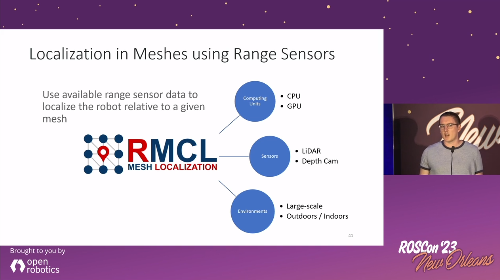

<div align="center" min-width=519px>
    
</div>


<!--  -->
<div align="center">
<h4 align="center">Software Tools for Mobile Robot Localization in 3D Meshes</h4>
</div>

<div align="center">
  <a href="https://github.com/uos/rmcl">Code</a>
  <span>&nbsp;&nbsp;•&nbsp;&nbsp;</span>
  <a href="https://github.com/uos/rmcl/wiki">Documentation</a>
  <span>&nbsp;&nbsp;•&nbsp;&nbsp;</span>
  <a href="https://youtube.com/playlist?list=PL9wBuzh6ev07O2YzbjP4qbcretntl5axI">Videos</a>
  <span>&nbsp;&nbsp;•&nbsp;&nbsp;</span>
  <a href="https://github.com/uos/rmcl/issues">Issues</a>
  <span>&nbsp;&nbsp;•&nbsp;&nbsp;</span>
  <a href="https://github.com/aock/rmcl_example">Examples</a>
  <br />
</div>


## MICP-L

MICP-L: Mesh ICP for Robot Localization using Hardware-Accelerated Ray Casting.
An approach to directly register range sensor data to a mesh in order to localize a mobile robot using hardware-accelerated ray casting correspondences (See publications).

[](http://www.youtube.com/watch?v=G-Z5K0bPFFU)


|  Hilti: 6DoF Localization  | MulRan: Large-scale scenes |
|:--:|:--:|
| <a href="http://www.youtube.com/watch?v=5pubwlbrpro" target="_blank" ></a> | <a href="http://www.youtube.com/watch?v=8j6ZtYPnFzw" target="_blank" ></a> |

Requirements:
- At least one range sensor equipped and running
- Triangle mesh as map
- Prior odometry estimation of the robot given as TF

IMU prior is also possible as long as it is integrated as TF-Transform, e.g. with [Madgwick Filter](http://wiki.ros.org/imu_filter_madgwick).

### Publication

MICP-L has been accepted to IROS'24! Please reference the following paper when using the MICP-L method in your scientific work.

```latex
@inproceedings{mock2024micpl,
  title={{MICP-L: Mesh-based ICP for Robot Localization using Hardware-Accelerated Ray Casting}}, 
  author={Mock, Alexander and Wiemann, Thomas and Pütz, Sebastian and Hertzberg, Joachim},
  booktitle={IEEE/RSJ International Conference on Intelligent Robots and Systems (IROS)}, 
  year={2024},
}
```

The [preprint](https://arxiv.org/abs/2210.13904) will be updated soon.

### Usage

The `micp_localization` Node starts the process of localizing the robot in a mesh using MICP and a given pose estimate. 
It is usually started through a Launch-File since it requires a large set of parameters.

### Launch

Starting the following Launch-File

```xml
<launch>

<arg name="map" default="$(find uos_gazebo_worlds)/Media/models/avz_neu.dae" />
<arg name="config" default="$(find rmcl)/config/examples/micp_velodyne_cpu.yaml" />

<node pkg="rmcl" type="micp_localization" name="micp_localization" output="screen">
    <param name="map_file" type="string" value="$(arg map)" />
    <rosparam command="load" file="$(arg config)" />
    <remap from="pose_wc" to="/initialpose" />
</node>

</launch>
```

runs the MICP localization. After that a pose has to be given, e.g. by the RViz "2D Pose Estimate" Tool that publishes the results on the `/initialpose` topic.
Doing that, make sure to set the fixed frame to the map coordinate system.
RMCL itself doesn't provide any tools to visualize the maps (triangle meshes).
If you want to visualize the map in RViz, use for example the `rviz_mesh_plugin` of the [mesh_tools](https://github.com/naturerobots/mesh_tools).

Once the launch file is started, the output in Terminal should look as follows:

```console
Combining Unit: CPU
MICP initiailized

-------------------------
    --- BACKENDS ---    
-------------------------
Available computing units:
- CPU
- GPU
Available raytracing backends:
- Embree (CPU)
- Optix (GPU)
MICP load params

-------------------------
     --- FRAMES ---      
-------------------------
- base:			base_footprint
- odom:			odom
  - base -> odom:	yes
- map:			map
Estimating: base_footprint -> map
Providing: odom -> map

-------------------------
     --- SENSORS ---     
-------------------------
- velodyne
  - data:		Topic
    - topic:		/velodyne_points
    - msg:		sensor_msgs/PointCloud2
    - data:		yes
    - frame:		velodyne
  - model:		Params
  - type:		spherical - loaded
  - micp:
    - backend:		embree
MICP load params - done. Valid Sensors: 1
Waiting for pose guess...
```

At startup, MICP does a few sanity checks for the input parameters.
Every possible mistake in configuration can then be inferred by this output.
For example, once there is no data available on the given `PointCloud2`-Topic it will print `data: no` instead.


### Params

The following sections describe example configuration files.
More example files for configuration are placed in the `config/examples`.

### Params - 3D LiDAR only - CPU

MICP Localization using a 3D LiDAR and doing the MICP steps completely on the CPU.
Here the 3D LiDAR is a Velodyne VLP-16 with 16 scan lines.
The horizontal number of points is reduced to 440 and might be adjusted for your own Velodyne.


File: `config/examples/micp_velodyne_cpu.yaml`

```yaml
# required
base_frame: base_footprint
map_frame: map
odom_frame: odom

# rate of broadcasting tf transformations
tf_rate: 50
invert_tf: False

micp:
  # merging on gpu or cpu
  combining_unit: cpu
  # maximum number of correction steps per second
  # lower this to decrease the correction speed but save energy 
  corr_rate_max: 1000
  print_corr_rate: False

  # adjust max distance dependend of the state of localization
  # helps to continuously disregard objects that not exist in the map
  adaptive_max_dist: True # enable adaptive max dist

  # offset added to inital pose guess
  trans: [0.0, 0.0, 0.0]
  rot: [0.0, 0.0, 0.0] # euler angles (3) or quaternion (4)  

# describe your sensor setup here
sensors: # list of range sensors - at least one is required
  velodyne:
    topic: velodyne_points
    # spherical is comparable to sensor_msgs::LaserScan 
    # but in 3D
    type: spherical
    model:
      range_min: 0.5
      range_max: 130.0
      phi_min: -0.261799067259
      phi_inc: 0.03490658503988659
      phi_N: 16
      theta_min: -3.14159011841
      theta_inc: 0.01431249500496489 
      theta_N: 440
    micp:
      max_dist: 1.0
      # Once adaptive_max_dist is set to true:
      # 
      # If the localization is perfect, the max
      # distance for finding SPCs is reduced to 
      # `adaptive_max_dist_min`.
      # If the localization is bad, the max
      # distance for finding SPCs is raised to
      # `max_dist`
      adaptive_max_dist_min: 0.15
      backend: embree
```

### Params - 2D LiDAR + Wheels - GPU

MICP also supports to localize a robot only equipped with a 2D LiDAR in a 3D map.
To correct the third dimension the wheels can be used to pull the robot towards the map's ground plane. 
Thus, you should only run it on a robot that always drives on the ground and e.g. cannot fly.
In this example, all MICP steps are computed on GPU.
The robot has four wheels of which the highest points are located relative to `base_footprint` as listed in `origs`.
By setting a virtual scanner to the wheel positions scanning downwards with a constant scanning range equal to the wheel diameter it is possible to pull the robot to the mesh.


File: `config/examples/micp_sick_gpu.yaml`

```yaml
# required
base_frame: base_footprint
map_frame: map
odom_frame: odom

# rate of broadcasting tf transformations
tf_rate: 50

micp:
  # merging on gpu or cpu
  combining_unit: gpu
  # maximum number of correction steps per second
  # lower this to decrease the correction speed but save energy 
  corr_rate_max: 1000
  print_corr_rate: False

  # adjust max distance dependend of the state of localization
  adaptive_max_dist: True # enable adaptive max dist

  # offset added to initial pose guess
  trans: [0.0, 0.0, 0.0]
  rot: [0.0, 0.0, 0.0] # euler angles (3) or quaternion (4)  

# describe your sensor setup here
sensors: # list of range sensors - at least one is required
  sick:
    topic: scan
    micp:
      weight: 1
      backend: optix
  wheels: # pull robot to the mesh
    ranges: [0.2, 0.2, 0.2, 0.2]
    type: ondn
    frame: base_footprint
    model:
      width: 4
      height: 1
      range_min: 0.0
      range_max: 10.0
      origs: [[ 0.2,  0.15,  0.2], # front left 
              [ 0.2, -0.15,  0.2], # front right
              [-0.2,  0.15,  0.2], # rear left
              [-0.2, -0.15,  0.2]] # rear right
      dirs:  [[ 0.0,  0.0, -1.0],
              [ 0.0,  0.0, -1.0],
              [ 0.0,  0.0, -1.0],
              [ 0.0,  0.0, -1.0]]
    micp:
      max_dist: 1.0
      adaptive_max_dist_min: 0.2
      weight: 1
      backend: optix
```


# RMCL - Project

## Installation

Dependencies:
- Download and install [Rmagine](https://github.com/uos/rmagine) (v > 2.2.0): Compile from source (not debian packages).
  - Recommended: Install OptiX backend if NVIDIA GPU is available
  - For rmagine version >= 2.2.2 it is possible to put rmagine into your ROS workspace for easier compilation
- ROS (tested with ROS-noetic)
- Clone [rmcl_msgs](https://github.com/uos/rmcl_msgs) to your workspace

Clone this repository into your ROS workspace and build it.

## Examples

To learn how to use RMCL ROS nodes in your project, visit https://github.com/aock/rmcl_example.

To learn how to use RMCL library in your Node: `src/nodes/examples`.

## Mesh Navigation

To navigate a robot automatically and safely through uneven terrain, the combination RMCL + Mesh Navigation Stack is very suitable: [https://github.com/naturerobots/mesh_navigation](https://github.com/naturerobots/mesh_navigation). As we presented on [ROSCon 2023](https://vimeo.com/879000775):

<a href="https://vimeo.com/879000775" target="_blank" ></a>

## Roadmap

This package will be expanded by more functionalities to localize a robot in mesh maps.
The planned Roadmap is as follows:

- [x] MICP-L
- [ ] RMCL

## News

### 2024-01-05: ROS2 - humble

The first ROS2 port has been released! If you are using ROS2, check out the `humble` branch of this and all linked repositories. After the new branch has been tested well enough, I will make it the main branch. The current version will persist in the `noetic` branch.