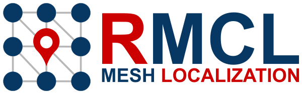
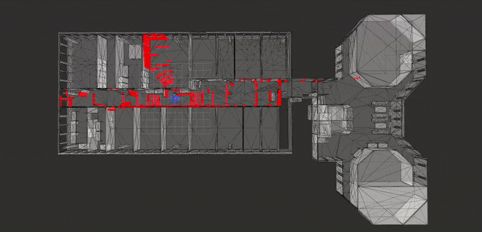
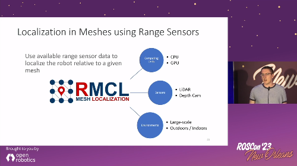

<div align="center" min-width=519px>
    
</div>


<!--  -->
<div align="center">
<h4 align="center">Software Tools for Mobile Robot Localization in 3D Meshes</h4>
</div>

<div align="center">
  <a href="https://github.com/uos/rmcl">Code</a>
  <span>&nbsp;&nbsp;•&nbsp;&nbsp;</span>
  <a href="https://github.com/uos/rmcl/wiki">Documentation</a>
  <span>&nbsp;&nbsp;•&nbsp;&nbsp;</span>
  <a href="https://youtube.com/playlist?list=PL9wBuzh6ev07O2YzbjP4qbcretntl5axI">Videos</a>
  <span>&nbsp;&nbsp;•&nbsp;&nbsp;</span>
  <a href="https://github.com/uos/rmcl/issues">Issues</a>
  <span>&nbsp;&nbsp;•&nbsp;&nbsp;</span>
  <a href="https://github.com/amock/rmcl_examples">Examples</a>
  <br />
</div>

<br/>

This repository contains algorithms designed for map-based robot localization, specifically when dealing with maps composed of triangle meshes or complete scene graphs. These maps may be provided by architects who have designed the building in which the robot operates, or they can be autonomously generated by the robot through Simultaneous Localization and Mapping (SLAM) methods. It's crucial to note that map-based localization differs from SLAM; it focuses on estimating the robot's pose within a potentially large map, whether the initial pose is roughly known (tracking) or entirely unknown from the start aka kidnapped robot problem. Map-based localization is essential for precisely planning the robot's missions on a given map.

## MICP-L - Pose Tracking in Meshes

MICP-L: Mesh-based ICP for Robot Localization Using Hardware-Accelerated Ray Casting.
An approach to directly register range sensor data to a mesh in order to localize a mobile robot using hardware-accelerated ray casting correspondences (See publications).

[](http://www.youtube.com/watch?v=G-Z5K0bPFFU)

|  Hilti: 6DoF Localization  | MulRan: Large-scale scenes |
|:--:|:--:|
| <a href="http://www.youtube.com/watch?v=5pubwlbrpro" target="_blank" ></a> | <a href="http://www.youtube.com/watch?v=8j6ZtYPnFzw" target="_blank" ></a> |

Requirements:
- At least one range sensor is equipped and running
- Triangle mesh as map
- Prior odometry estimation of the robot given as TF

IMU prior is also possible as long as it is integrated as TF-Transform, e.g. with [Madgwick Filter](http://wiki.ros.org/imu_filter_madgwick).

Read more details [here](./docs/MICPL.md) or if you seek for a quick start and you have no robot available, go to our hands-on examples: [https://github.com/amock/rmcl_examples](https://github.com/amock/rmcl_examples).

### Publication

Please reference the following paper when using the MICP-L method in your scientific work.

```bib
@inproceedings{mock2024micpl,
  title={{MICP-L}: Mesh-based ICP for Robot Localization Using Hardware-Accelerated Ray Casting}, 
  author={Mock, Alexander and Wiemann, Thomas and Pütz, Sebastian and Hertzberg, Joachim},
  booktitle={2024 IEEE/RSJ International Conference on Intelligent Robots and Systems (IROS)}, 
  year={2024},
  pages={10664-10671},
  doi={10.1109/IROS58592.2024.10802360}
}
```

The paper is available on [IEEE Xplore](https://ieeexplore.ieee.org/document/10802360) and as preprint on [arXiv](https://arxiv.org/abs/2210.13904). The experiments are available at [https://github.com/amock/micp_experiments](https://github.com/amock/micp_experiments), but they are primarily compatible with the ROS 1 version.  
See the older branches or commits for reference.

## Raycasting Monte Carlo Localization (RMCL)

The `rmcl_localization_node` provides a practical, real-time implementation of Monte Carlo Localization (MCL) for global robot localization, accelerated by high-performance ray tracing over triangle meshes and geometric scene graphs. MCL has a decades-long track record; our focus is making it easy to deploy and tune on real robots. The pipeline scales across diverse hardware with parameters to meet tight compute and memory budgets (including for our smallest robots). The documentation begins with hands-on usage and configuration of `rmcl_localization_node`, followed by a concise overview of the underlying concepts and design choices.



Read more details [here](./docs/RMCL.md).


# RMCL - Project

## Installation

Dependencies:
- ROS 2 (check compatible branches)
- Download and put [Rmagine](https://github.com/uos/rmagine) (v >= 2.3.0) into your ROS workspace.
  - Recommended: Install OptiX backend if NVIDIA GPU is available.
- Optional for functionality, but required for visualizations: [mesh_tools](https://github.com/naturerobots/mesh_tools).

Clone this repository into your ROS workspace and build it.

```console
colcon build
```

### Branch Compatibility

|  RMCL Branch    |  Supported ROS 2 versions    |
|:----|:----|
|  main   |  humble, jazzy |

## Mesh Navigation

To navigate a robot automatically and safely through uneven terrain, the combination RMCL + Mesh Navigation Stack is very suitable: [https://github.com/naturerobots/mesh_navigation](https://github.com/naturerobots/mesh_navigation). As we presented on [ROSCon 2023](https://vimeo.com/879000775):

<a href="https://vimeo.com/879000775" target="_blank" ></a>

## Roadmap

This package will be expanded by more functionalities to localize a robot in mesh maps.
The planned Roadmap is as follows:

- [x] MICP-L (Pose Tracking)
- [ ] RMCL (Global Localization)

## News

### 2025-05-17: ROS 2-ify MICP-L - v2.2.0

After conducting real-world tests, we refactored the **MICP-L** node to better integrate it into the **ROS 2** ecosystem and added several new features:
- Limited the possible inputs to *only* `rmcl_msgs`. Instead, we provide nodes and instructions to convert commonly used range sensor messages into `rmcl_msgs`.
- MICP-L can now be launched as a composable node.
- Separated correspondence search from optimization without losing much efficiency. This allowed us to add classic closest-point correspondences (CP), in addition to ray-casting correspondences (RC) (only available for embree backend).
- Improved time synchronization between combinations of sensors and odometry.
- Added many new examples and small demos for a quick start: [https://github.com/amock/rmcl_examples](https://github.com/amock/rmcl_examples)

> For the old version, download v2.1.0

### 2024-11-25: Restructuring - ROS 1 + ROS 2

We had to do minor structural changes to the repository in order to better integrate new features into RMCL. This repository is now devided into
- "rmcl" which is a ROS-agnostic library that can be compiled and installed as regular CMake project,
- "rmcl_ros" which contains all the nodes,
- "rmcl_msgs" which are the message moved from to this repository. The original msgs repository is not required anymore.

Using the latest rmcl version might break your launch files as the nodes are now located in "rmcl_ros" package. However, it's rather simple to fix that.
The new versions of RMCL are v2.1.0 for ROS 2 and v1.3.0 for ROS 1.

### 2024-02-11: ROS2 release - v2.0.0

The main branch is humble now! Since it is not backwards compatible we decided to increase the version of RMCL to 2.0.0. The noetic version will still exist with the "noetic" branch. The "noetic" branch will be maintained until the end of 2024.

### 2024-01-05: ROS2 - humble

The first ROS2 port has been released! If you are using ROS2, check out the `humble` branch of this and all linked repositories. After the new branch has been tested well enough, I will make it the main branch. The current version will persist in the `noetic` branch.
